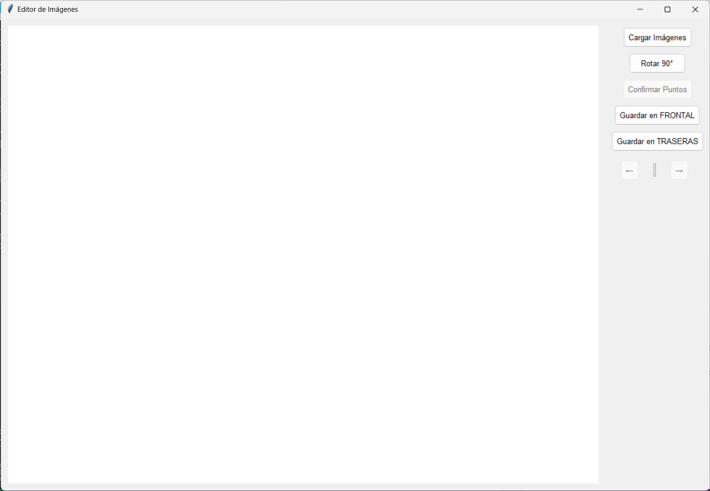

# Image Document Perspective Warper

## Descripción

**Image Document Perspective Warper** es una herramienta diseñada para procesar fotos de documentos en horizontal de manera rápida y eficiente. Su propósito específico es separar las partes frontal y trasera de los documentos sin la necesidad de procesarlas individualmente en editores de fotos. Este software permite la transformación de perspectiva de las imágenes, facilitando la corrección de la perspectiva de documentos fotografiados, para que parezcan escaneados. Cabe aclarar que esta herramienta se uso para uso personal y no pretende ser un reemplazo para ningún editor, solo es un programa que hice para facilitarme un proceso especifico.

## Características

- Cargar múltiples imágenes simultáneamente mediante un diálogo de archivos o arrastrar y soltar.
- Selección de cuatro puntos de interés para ajustar la perspectiva de la imagen.
- Transformación automática de la perspectiva para corregir la imagen.
- Guardado de imágenes en carpetas específicas para las partes frontal y trasera del documento.
- Rotación de imágenes en incrementos de 90 grados.
- Función de deshacer para revertir la última acción.

## Requisitos

- Python 3.6 o superior
- Librerías: tkinter, tkinterdnd2, PIL (Pillow), numpy, OpenCV

## Instalación

1. Clona este repositorio:

```bash
git clone https://github.com/T-UwU/Image-Document-Perspective-Warper.git
```

2. Navega al directorio del proyecto:

```bash
cd Image-Document-Perspective-Warper
```

3. Instala las dependencias:

```bash
pip install -r requirements.txt
```

## Uso

1. Ejecuta el script principal:

```bash
python src/image_document_perspective_warper.py
```

2. Usa el botón "Cargar Imágenes" para seleccionar múltiples imágenes de documentos.
3. Selecciona cuatro puntos en cada imagen para definir las esquinas del documento.
4. Usa los botones para rotar, deshacer y guardar las imágenes en las carpetas designadas.

## Interfaz de Usuario



## Contribuciones

Las contribuciones son bienvenidas. Por favor, abre un issue o envía un pull request para discutir posibles mejoras o correcciones.

## Licencia

Este proyecto está licenciado bajo la The Unlicense.
